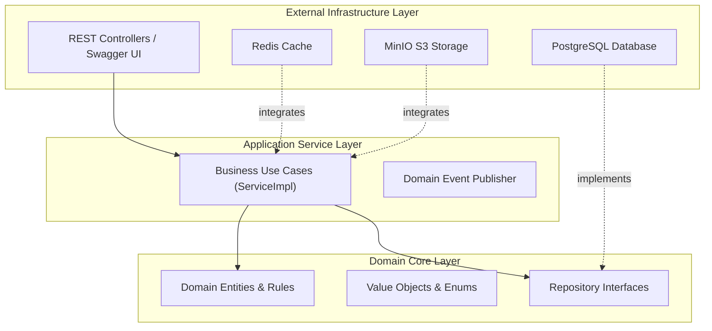
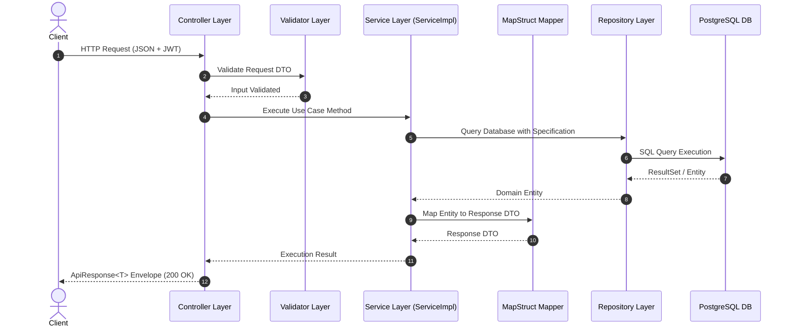
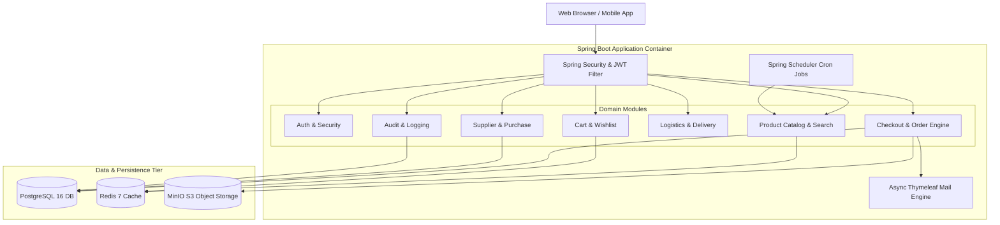
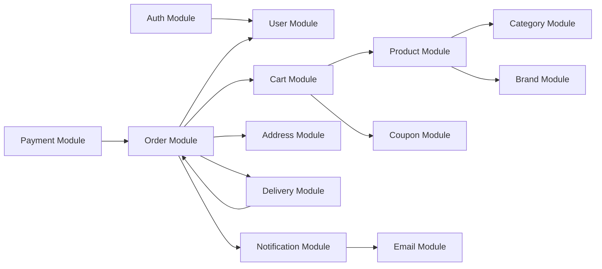
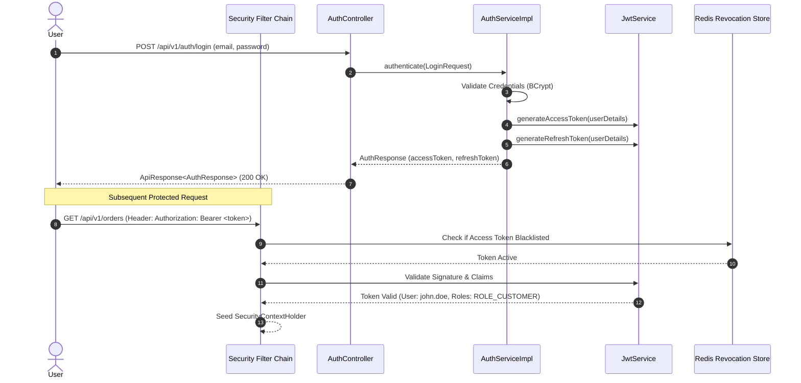
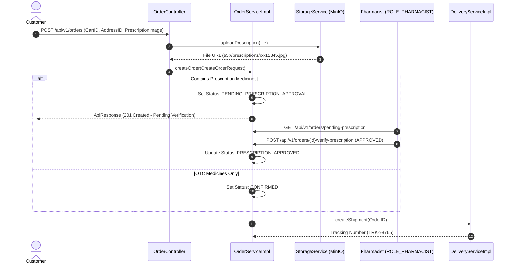
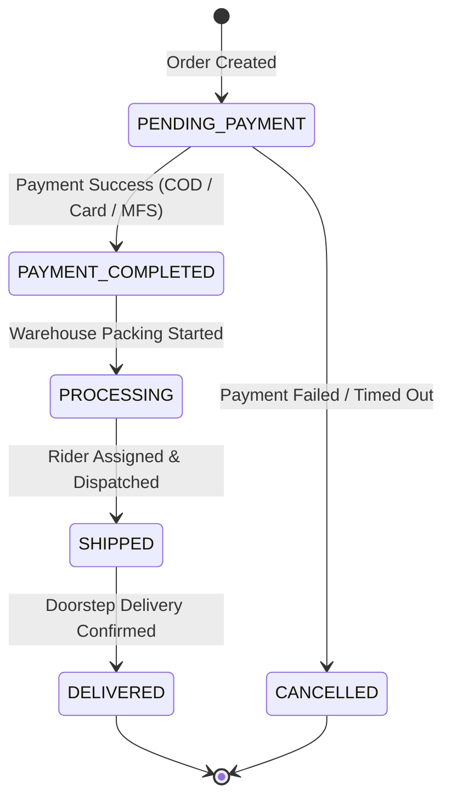
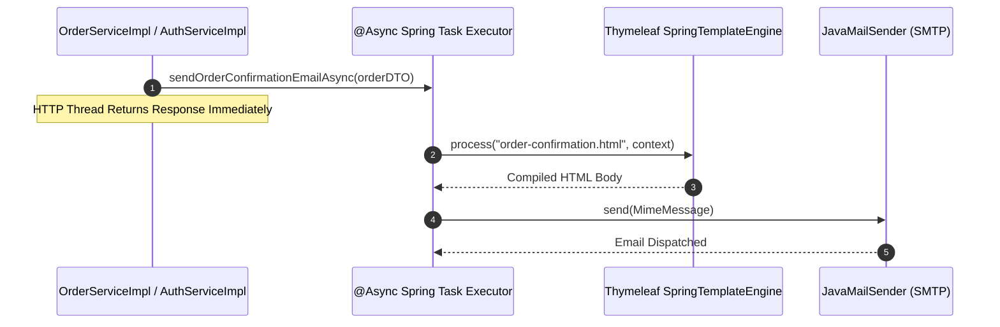
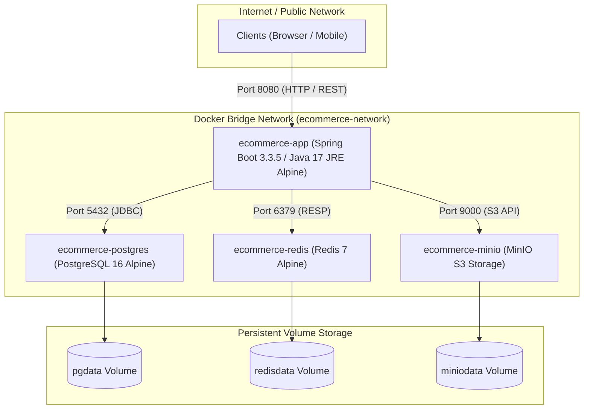

# SYSTEM ARCHITECTURE

**Project Title**: Enterprise Pharmacy E-Commerce Backend  
**Document**: Architecture Blueprint & System Design Specification  
**Architecture Model**: Clean Architecture, Layered Architecture, Microservice-Ready Monolith  
**Version**: 1.0.0  

---

## 1. Executive Summary

The **Enterprise Pharmacy E-Commerce Backend** is built on Clean Architecture and Layered Architecture principles. Designed as a microservice-ready modular monolith, it enforces strict separation of concerns between HTTP presentation controllers, core domain business logic, Data Transfer Objects (DTOs), persistence entity models, database access repositories, and external infrastructure integrations.

The architecture emphasizes high availability, zero N+1 database query traps, sub-50ms catalog cache lookups via Redis 7, digital prescription document management via MinIO S3, resilient background job processing via Spring Scheduler, and seamless containerization using Docker Compose.

---

## 2. Architecture Overview

The system architecture partitions concerns into five distinct structural layers:

1. **Client / Web API Layer**: Exposes RESTful JSON endpoints under `/api/v1/...` protected by Spring Security filters and documented via OpenAPI v3 / Swagger UI.
2. **Controller Layer**: Handles incoming HTTP requests, enforces Jakarta Bean Validation, validates authorization roles (`ROLE_CUSTOMER`, `ROLE_PHARMACIST`, `ROLE_ADMIN`), and delegates execution to service interfaces.
3. **Service Layer (`ServiceImpl`)**: Houses 100% of domain business logic, transactional boundaries (`@Transactional`), cache eviction rules, and domain event publishing.
4. **Data Access Layer (`Repository` & `Specification`)**: Executes type-safe queries using Spring Data JPA, Hibernate, B-Tree indexed PostgreSQL tables, and dynamic multi-criteria Specifications.
5. **Infrastructure Layer**: Connects to Redis 7 (caching), MinIO S3 (prescription object storage), SMTP (asynchronous HTML email delivery), and Spring Boot Actuator/Prometheus (observability).

---

## 3. Clean Architecture

Clean Architecture principles isolate core business logic from external frameworks, database ORMs, and web drivers.



- **Dependency Inversion Principle**: Higher-level business use cases depend on domain repository interfaces, not concrete PostgreSQL data access classes.
- **Framework Independence**: Business validation and state transitions run independently of web framework details.

---

## 4. Layered Architecture

The physical package structure reflects a strict top-down execution flow:

```
com.example.ecommerce.module/
├── controller/        --> Request Validation, Security Authorization, ApiResponse Envelopes
├── service/           --> Service Interfaces
│   └── impl/          --> Business Logic, Transaction Boundaries, Cache Eviction
├── repository/        --> JPA Repositories extending BaseRepository
├── entity/            --> JPA Entities extending BaseEntity
├── dto/               --> Request & Response DTOs
├── mapper/            --> MapStruct Mappers
├── specification/     --> Dynamic Search Specifications
└── validator/         --> Business Rule & State Transition Validation
```



---

## 5. Component Diagram

The component topology highlights module boundaries and external system drivers.



---

## 6. Module Interaction Diagram

The diagram below illustrates cross-module dependency paths during shopping and order placement.



---

## 7. Authentication Flow

Authentication uses JWT Access Tokens (short-lived) and Refresh Tokens (long-lived) with revocation tracking.



---

## 8. Checkout & Prescription Flow

Orders containing prescription-required medicines enter a dedicated validation workflow before fulfillment.



---

## 9. Order & Payment Flow



---

## 10. Notification Flow

Asynchronous email delivery prevents HTTP worker thread blocking.



---

## 11. Deployment Architecture

The application deploys as a multi-container Docker composition.



---

## 12. Technology Stack Overview

| Tier / Category | Technology Selected | Version | Purpose & Rationale |
| :--- | :--- | :--- | :--- |
| **Language** | Java LTS | `17` | Long-term support, records, pattern matching, sealed types, improved G1GC performance. |
| **Framework** | Spring Boot | `3.3.5` | Modern web framework, Spring Security 6, Jakarta EE 10 compatibility. |
| **Relational DB** | PostgreSQL | `16` | ACID compliance, JSONB support, B-Tree indexes, Flyway migration safety. |
| **Cache & Store** | Redis | `7.0` | High-speed cache for catalog items, search autocomplete, and token blacklists. |
| **Object Storage** | MinIO S3 | `RELEASE...` | S3-compatible file storage for digital prescriptions and product media. |
| **Documentation** | Springdoc OpenAPI | `2.6.0` | Interactive OpenAPI 3 / Swagger documentation and testing. |
| **Build & Packaging** | Maven | `3.9` | Dependency management, multi-stage Docker builds, JaCoCo coverage reports. |

---

## 13. Scalability, High Availability & Performance Strategy

### 13.1 Scalability
- **Stateless App Tier**: JWT session management allows scaling Spring Boot application containers horizontally behind a load balancer without sticky sessions.
- **Read/Write Splitting**: Database read replicas can be added with zero changes to service code using Spring Data `@Transactional(readOnly = true)`.

### 13.2 High Availability & Resiliency
- **Redis AOF Persistence**: Redis is configured with Append-Only File (AOF) logging to prevent cache data loss on container restarts.
- **Graceful Shutdown**: Spring Boot configures `server.shutdown=graceful` with a 30-second shutdown phase to complete active transactions.

### 13.3 Performance Strategy
- **Catalog Caching**: Products (`products`), categories (`categories`), and brands (`brands`) are cached with dedicated TTLs (1h, 24h, 24h).
- **Index Optimization**: B-Tree indexes on `sku`, `slug`, `category_id`, `brand_id`, `status`, and `deleted` eliminate full table scans.
- **N+1 Prevention**: JPA Join Fetch and `@BatchSize(size = 25)` configurations enforce bulk fetching.

---

## 14. Security Strategy

1. **Role-Based Access Control (RBAC)**: Endpoint method security (`@PreAuthorize("hasRole('ADMIN')")`) protects administrative APIs.
2. **Input Validation**: All incoming request DTOs are validated using Jakarta Bean Validation constraints (`@Valid`).
3. **Data Protection**: Sensitive parameters (passwords, JWT tokens, credit card details) are masked in SLF4J logs by `LoggingMaskUtils`.
4. **Non-Root Execution**: Containerized Spring Boot runner stages execute under non-root system account `ecommerce` (UID 10001).
